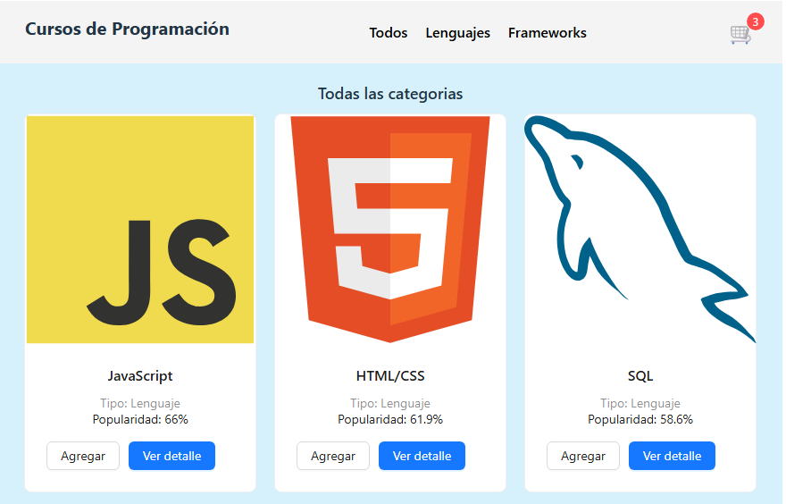
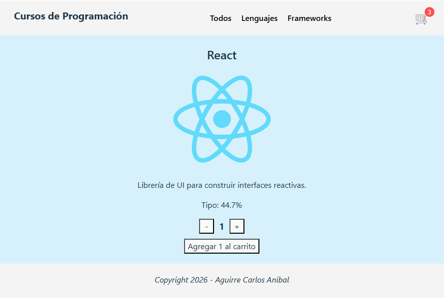

# Mi App de eCommerce
# Cursos de Programación

El proyecto de Cursos de Programación es una app de una página que esta realizado con React para tener código en diferentes Componentes. Su finalidad es educativa para realizar la simulación de un carrito de compras para cursos online y/o manuales de estudio para cada lenguaje o framework seleccionado. En la imagen del carrito, se puede hacer clic para ver una lista básica de los productos agregados. En el mismo se utiliza react router para la navegación y el modelo Page single App para que no recarge completamente la página del navegador. Al finalizar, se utilizo Ant Design para visuales más atractivas en tarjetas, botones, entre otros, se desarrollo todo el front-end de la webapp de tipo e-commerce y se incorporo Firestore como base de datos.

## Deploy
- 

## Instalación

Instalaciones para instalar y configurar el proyecto.

```bash
git clone https://github.com/CarlosLaboratorio/cursosprogramacionya.git
cd miecommercecoder
npm install
npm install antd
```

## Contribución
1. Haz un fork del proyecto.
2. Crea una rama.
3. Realiza tus cambios y haz commit.
4. Sube tu rama.
5. Abre un pull Request.

## Caracteristicas

- Facil de instalar.
- Interfaz amigable.
- Soporte multiplataforma.

## Vistas de la App

Vista Principal:


Vista de Detalle:


## Enlaces

-[Documentación oficial](https://react.dev)

## Acerca del Creador

<h1 align="center">Hi 👋, I'm Carlos Aguirre</h1>
<h3 align="center">A passionate frontend developer from Argentina</h3>

- 🔭 I’m currently working on **Cursos Online**

- 📫 How to reach me **carlosanibal815@gmail.com**

<h3 align="left">Connect with me:</h3>
<p align="left">
<a href="https://linkedin.com/in/carlos-aníbal-aguirre-b768a0a9/" target="blank"></a>
</p>

<h3 align="left">Languages and Tools:</h3>
<p align="left"> <a href="https://www.arduino.cc/" target="_blank" rel="noreferrer">  </a> <a href="https://getbootstrap.com" target="_blank" rel="noreferrer">  </a> <a href="https://www.w3schools.com/cpp/" target="_blank" rel="noreferrer">  </a> <a href="https://www.w3schools.com/css/" target="_blank" rel="noreferrer">  </a> <a href="https://www.djangoproject.com/" target="_blank" rel="noreferrer">  </a> <a href="https://git-scm.com/" target="_blank" rel="noreferrer">  </a> <a href="https://www.w3.org/html/" target="_blank" rel="noreferrer">  </a> <a href="https://developer.mozilla.org/en-US/docs/Web/JavaScript" target="_blank" rel="noreferrer">  </a> <a href="https://www.microsoft.com/en-us/sql-server" target="_blank" rel="noreferrer">  </a> <a href="https://nodejs.org" target="_blank" rel="noreferrer">  </a> <a href="https://www.python.org" target="_blank" rel="noreferrer">  </a> <a href="https://reactjs.org/" target="_blank" rel="noreferrer">  </a> <a href="https://sass-lang.com" target="_blank" rel="noreferrer">  </a> <a href="https://www.sqlite.org/" target="_blank" rel="noreferrer">  </a> </p>